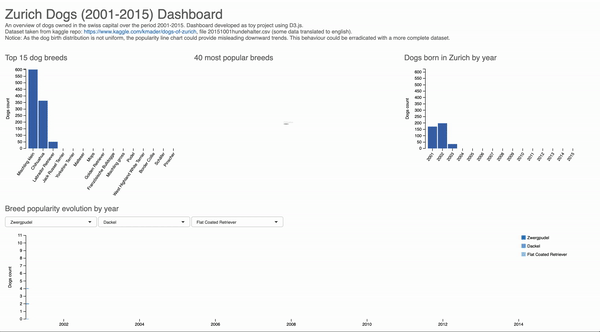

# Zurich Dogs (2001-2015) Dashboard
A quick overview of dogs breeds owned in Zurich over the period 2001-2015. Dashboard developed using D3.js functionalities.
Dataset taken from kaggle repo: https://www.kaggle.com/kmader/dogs-of-zurich, file 20151001hundehalter.csv (some data translated to english).

Notice: As the dog birth distribution is not uniform, the popularity line chart could provide misleading downward trends. This behaviour could be erradicated with a more complete dataset.

### Showcase
Below is a quick showcase of the dashboard animations and interactions.

### Running this project
A server can be started by typing "node app.js" in a terminal inside the project directory. Please be aware that nodejs and express are requisites to run this application. After the server is running, please access the app by opening http://localhost:3000 in a web browser.

### Functionalities
* Bar charts with hover tooltips.
* Selectable word cloud.
* Line chart with hover tooltips and search capabilities.
